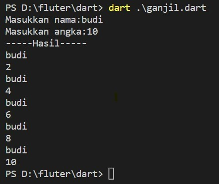
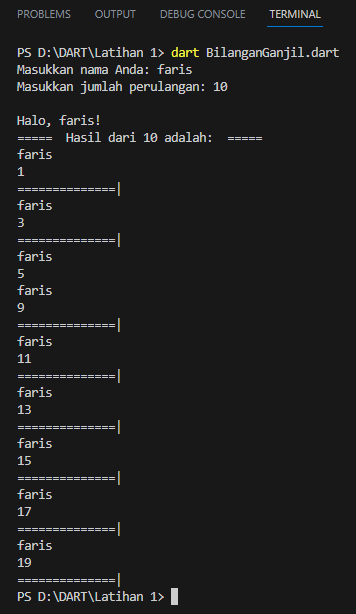

# Dart-NamadanBilangan

| Nama    | Faris Syahluthfi |
| ------- | ----------- |
| NIM     | 312010034       |
| Kelas   | TI.20.A.1        |
| Mata Kuliah   | Pemrograman Mobile  |
| Dosen  | Muhammad Najamuddin Dwi Miharja, S.Kom, M.kom  |

</p>

## Menghitung dan menampilkan nama dan nilai perulangan bilangan </p> </br>

Soal Dart: </p></br>
</p> </br>

1.  Nama dan Nilai Perulangan Bilangan Ganjil </p></br>

<li> Source Code: </p></br> </li>

``` dart

import 'dart:io';

void main() {
  stdout.write("Masukkan nama Anda: ");
  String nama = stdin.readLineSync()!;
  stdout.write("Masukkan jumlah perulangan: ");
  int jumlahPerulangan = int.parse(stdin.readLineSync()!);

  print("\nHalo, $nama!");

  print("=====  Hasil dari $jumlahPerulangan adalah:  ===== ");

  int count = 1;
  int number = 1;

  while (count <= jumlahPerulangan) {
    if (number % 2 != 0) {
      print(nama);
      print(number);
      print("==============|");
      count++;

      
    }
    number++;

    
  }
}

```

</p></br>

<li> Penjelasan dari kode diata: </li></p><br>

1. Import 'dart:io':
   Baris pertama pada kode tersebut mengimpor pustaka dart:io, yang digunakan untuk berinteraksi dengan input/output (I/O) di dalam program.

2. void main():
   Fungsi utama yang akan dieksekusi ketika program dijalankan.

3. stdout.write("Masukkan nama Anda: ");
   Mengeluarkan prompt ke terminal untuk meminta pengguna memasukkan nama. stdout.write digunakan untuk menampilkan teks tanpa garis baru di akhirnya.

4. String nama = stdin.readLineSync()!;
   Membaca input dari pengguna yang merupakan nama, menggunakan stdin.readLineSync(). Input tersebut disimpan dalam variabel "nama" yang memiliki tipe data String. Tanda seru (!) menandakan bahwa variabel "nama" tidak boleh bernilai null.

5. stdout.write("Masukkan jumlah perulangan: ");
   Mengeluarkan prompt ke terminal untuk meminta pengguna memasukkan jumlah perulangan.

6. int jumlahPerulangan = int.parse(stdin.readLineSync()!);
   Membaca input dari pengguna yang merupakan jumlah perulangan yang diinginkan. stdin.readLineSync() digunakan untuk membaca input sebagai String, kemudian fungsi int.parse() digunakan untuk mengonversi String menjadi bilangan bulat (int). Input tersebut disimpan dalam variabel "jumlahPerulangan" yang memiliki tipe data int. Tanda seru (!) menandakan bahwa variabel "jumlahPerulangan" tidak boleh bernilai null.

7. print("\nHalo, $nama!");
   Menampilkan pesan sambutan yang mengandung nama pengguna yang dimasukkan oleh pengguna.

8. print("=====  Hasil dari $jumlahPerulangan adalah:  ===== ");
   Menampilkan header yang menggambarkan bahwa output berikutnya adalah hasil dari jumlah perulangan.

9. int count = 1;
   Variabel "count" diinisialisasi dengan nilai 1. Variabel ini akan digunakan untuk menghitung jumlah perulangan.

10. int number = 1;
    Variabel "number" diinisialisasi dengan nilai 1. Variabel ini akan digunakan untuk menyimpan angka yang akan ditampilkan.

11. while (count <= jumlahPerulangan) {
       while-loop akan terus dijalankan selama nilai "count" masih kurang dari atau sama dengan "jumlahPerulangan".

12. if (number % 2 != 0) {
       Pernyataan ini memeriksa apakah "number" adalah bilangan ganjil. Jika benar, maka blok kode di dalamnya akan dijalankan.

13. print(nama);
      Menampilkan nama pengguna.

14. print(number);
      Menampilkan nilai "number".

15. print("==============|");
      Menampilkan garis pemisah.

16. count++;
      Meningkatkan nilai "count" sebesar 1 untuk menghitung jumlah perulangan.

17. number++;
      Meningkatkan nilai "number" sebesar 1 untuk memperoleh angka selanjutnya dalam deret.

18. }
    Tutup blok while-loop.
</br></p>


<li> Output Programnya: </li></p><br>

</p> </br>

2.  Nama dan Nilai Perulangan Bilangan Genap </p></br>

<li> Source Code: </p></br> </li>

``` dart

import 'dart:io';

void main() {
  print('Masukkan Nama Anda:');
  String nama = stdin.readLineSync()!;

  print('Masukkan batas perulangan:');
  int batas = int.parse(stdin.readLineSync()!);

  print("===== Hasil =====");

  for (int i = 1; i <= batas; i++) {
    if (i % 2 == 0) {
      print(nama);
      print(i);
      print("==============|");
    }
  }

  print('Terima kasih, $nama!');
}

```

</br></p>

<li> Penjelasan dari kode diata: </li></p><br>


